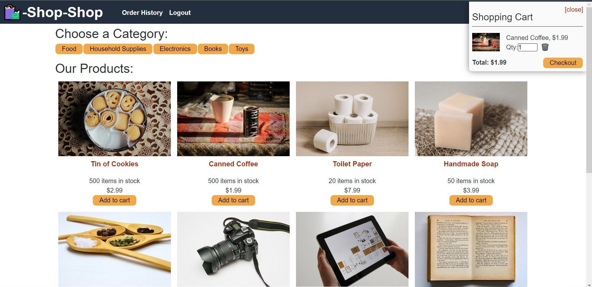

# Redux Store

## Description

This is an ecommerce site that uses React.js and Redux. The goal was to take existing source code of the website which used React's Context API to create a GlobalState component and instead rewrite the code to use a Redux store.

The website Shop-Shop lists several items for sale. Users can filter using the Categories on the top (Food, Electronics, etc.) for a smaller list of what they are looking for. If they want to buy an item, they can choose "Add to Cart" to add it to the Cart on the top right corner. From there, they can either increase the quantity by pressing on the "Add to Cart" button again, or using the arrow keys on the quantity itself. If they don't want the item anymore, they can click the trash button to remove it from the cart.

To checkout, users must sign up and log in to the website. Once logged in, the page will be redirect to Stripe (test mode!) where they can check out.

## Resources

React-Redux Quick Start tutorial: [https://react-redux.js.org/tutorials/quick-start](https://react-redux.js.org/tutorials/quick-start)

Redux Fundamentals: [https://redux.js.org/tutorials/fundamentals/part-1-overview](https://redux.js.org/tutorials/fundamentals/part-1-overview)

Redux configureStore: [https://redux-toolkit.js.org/api/configureStore](https://redux-toolkit.js.org/api/configureStore)

## Links

Link to site:

GitHub repository link: [https://github.com/cindyung56/redux-store](https://github.com/cindyung56/redux-store)